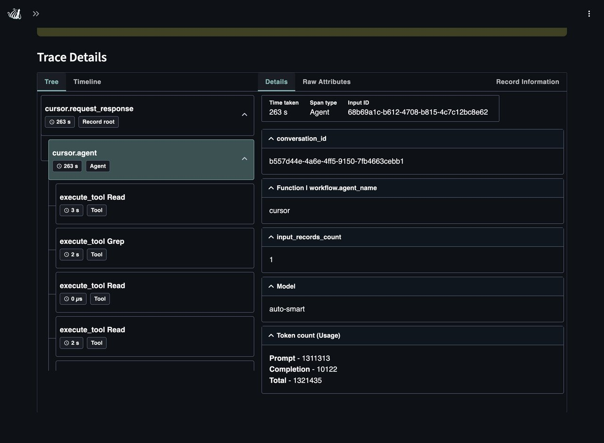

---
categories:
  - General
date: 2026-09-01
---

# Instrument Coding Agents: Trace Cursor, Claude Code, and OpenCode with Zero Code Changes

TruLens can now trace Cursor, Claude Code, and OpenCode sessions by attaching to each client's native lifecycle hooks — no app code, no wrapper, no SDK integration. Install a plugin, point it at a destination, and every prompt, tool call, file edit, shell command, MCP call, and subagent invocation becomes an OTEL trace using the same semantic conventions as any other TruLens app.

<!-- more -->

---

## The Problem

Coding agents aren't apps you instrument — they're binaries you install. There's no `chain.invoke()` to wrap, no import to monkeypatch. If you want to know what Cursor, Claude Code, or OpenCode actually did during a session — which tools ran, which files changed, whether a shell command failed, what the model returned — you're stuck reading raw JSONL transcripts or nothing at all.

Each of these clients already emits lifecycle events: Claude Code and Cursor fire JSON hook commands on prompt submission, tool use, and stop; OpenCode exposes a native plugin API. TruLens now listens to those events directly.

## Install a Client

```bash
pip install trulens-core trulens-apps-cursor
trulens-client-hooks install cursor --dry-run
trulens-client-hooks install cursor
```

Same pattern for `trulens-apps-claude` and `trulens-apps-opencode`. The shared runtime lives in `trulens-core`; each client package is a thin plugin with only its native hook contract. OpenCode doesn't use JSON hooks, so its installer writes a managed plugin file that forwards native lifecycle events to `trulens-client-hooks ingest` instead.

Add `--project` to install into the current repo instead of the user's global config. The installer preserves any hooks you already have, writes a backup, and is idempotent.

## Point It at a Destination

Local SQLite by default. Also supports Postgres, Snowflake, and OTLP:

```bash
export TRULENS_DESTINATION=database
export TRULENS_DATABASE_URL="postgresql+psycopg://trulens@localhost/traces"
```

Identity is automatic: app name is the client (`cursor`, `claude`, `opencode`) and app version comes from the native client itself. On Snowflake, where runs are a first-class concept, the run name is the native conversation or session ID. OSS and OTLP destinations export spans without a run name — there's no run to name. No manual tagging required either way — `TRULENS_APP_NAME`, `TRULENS_APP_VERSION`, and `TRULENS_RUN_NAME` are there if you want to override.

## Privacy Is Opt-In by Default

Lifecycle metadata (event types, timing, tool names, pass/fail) is captured automatically. Anything that can contain source code or credentials is off unless you turn it on:

```bash
export TRULENS_CAPTURE_CONTENT=true       # prompts and responses
export TRULENS_CAPTURE_TOOL_PAYLOADS=true # tool arguments/results
export TRULENS_CAPTURE_DIFFS=true         # file edit diffs
export TRULENS_CAPTURE_PATHS=true         # file paths
```

Everything captured is redacted and size-bounded before it's written to disk.

## What You Get

Each conversation maps to one TruLens conversation; each prompt within it maps to a distinct turn and `RECORD_ROOT` span:

```text
Agent span
├── Request/response RECORD_ROOT span
├── Tool, edit, shell, MCP, and subagent spans
└── Response-generation span
```



These are ordinary TruLens traces — the existing input/output and trace-level selectors work without any client-specific logic. Model inference, structured messages, token usage, and tool execution use official OTEL GenAI conventions; coding-agent-only concepts (client name, native hook event, editor version, workspace, diffs) live under `ai.observability.*` in `trulens-otel-semconv`.

On a Snowflake destination, TruLens also manages [AI Observability](https://docs.snowflake.com/en/user-guide/snowflake-cortex/ai-observability) run lifecycle: each conversation becomes a run, each turn an invocation, driven to `COMPLETED` automatically as spans land. OSS and OTLP destinations skip run management entirely — they just export spans.

## Evaluate the Traces

Hook traces are ordinary TruLens records, so they run through the same evaluation path as any other app — no live wrapper, no `TruApp`. Point a session at the same database the worker exports to, pull the events, and score them offline:

```python
from trulens.core import Metric, Selector, TruSession
from trulens.providers.openai import OpenAI

session = TruSession(
    database_url="postgresql+psycopg://trulens@localhost/traces"
)
provider = OpenAI(model_engine="gpt-4o")

f_tool_selection = Metric(
    implementation=provider.tool_selection_with_cot_reasons,
    name="Tool Selection",
    selectors={"trace": Selector(trace_level=True)},
)
f_execution_efficiency = Metric(
    implementation=provider.execution_efficiency_with_cot_reasons,
    name="Execution Efficiency",
    selectors={"trace": Selector(trace_level=True)},
)
f_session_coherence = Metric(
    implementation=provider.coherence_across_turns_with_cot_reasons,
    name="Session Coherence",
).on_conversation()

events = session.get_events(app_name="cursor", app_version=None)
session.compute_feedbacks_on_events(
    events, [f_tool_selection, f_execution_efficiency, f_session_coherence]
)
```

`Tool Selection` and `Execution Efficiency` score a single turn against its full trace — did the agent pick the right tools, did it take an efficient path to the edit. `Session Coherence` runs `.on_conversation()` instead, scoring whether later turns in the same Cursor/Claude/OpenCode session contradict earlier instructions. `CONVERSATION_ID` is already set from the client's native session ID, so no extra wiring is needed to group turns into a conversation.

To get useful evals out of this, turn on all three content flags — `TRULENS_CAPTURE_CONTENT`, `TRULENS_CAPTURE_TOOL_PAYLOADS`, and `TRULENS_CAPTURE_DIFFS` — before the session runs. Each gates its own fields independently and all default to off, so `Tool Selection` and `Execution Efficiency` only see what they need — tool names, arguments, and results, not just timing — when the tool-payload flag is on. Content captured after the fact can't be reconstructed, so set these upfront on any session you intend to evaluate.

Scores land in the same leaderboard as everything else in that database, so `(app_name, app_version)` — Cursor 3.x vs. Claude Code vs. OpenCode — is a comparison you get for free.

## Built for a Machine That Can Crash Mid-Session

Hook invocations return immediately after writing to a locked, durable journal — the coding client is never blocked on export. A detached worker drains the journal, retries transient failures with backoff, and survives process restarts:

```bash
trulens-client-hooks status cursor
trulens-client-hooks validate
trulens-client-hooks flush   # synchronous recovery after a crash
```

Retried exports are idempotent: re-exporting a journalled turn reuses the same record ID, input ID, trace ID, and (on Snowflake) run name rather than creating a duplicate.

Runtime hooks fail open — telemetry errors go to stderr and never block the coding client itself.

## Get Started

```bash
pip install trulens --upgrade
```

---

Questions or feedback? Open an [issue](https://github.com/truera/trulens/issues) or [discussion](https://github.com/truera/trulens/discussions).
