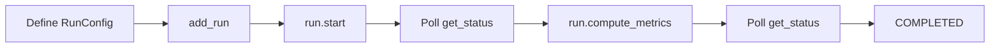

# Batch Evaluation with Runs

Runs provide a structured way to evaluate your LLM application over a dataset. Instead of evaluating one query at a time, you define a **run** that invokes your app on every row of a dataset, ingests the resulting traces, and then computes metrics across the entire batch.

## Overview

The batch evaluation workflow has four steps:

1. **Wrap your app** with `TruApp` and connect to a session.
2. **Create a `RunConfig`** that points to a dataset and maps its columns to span attributes.
3. **`run.start()`** — invokes your app for every row, exports OTEL spans, and kicks off server-side ingestion.
4. **`run.compute_metrics()`** — computes metrics (server-side or client-side) over the ingested traces.



## Key Concepts

### RunConfig

A `RunConfig` describes what data to evaluate and how to interpret it.

| Field | Description |
|---|---|
| `run_name` | Unique name for this run. |
| `dataset_name` | Name of the source table (or user-specified name for a dataframe). |
| `source_type` | `"TABLE"` for a database table, `"DATAFRAME"` for a user-provided dataframe. |
| `dataset_spec` | Maps reserved span attribute fields to column names in your dataset. |
| `description` | Optional description. |
| `label` | Optional text label to group related runs. |
| `mode` | `APP_INVOCATION` (default) invokes your app; `LOG_INGESTION` creates spans from existing data without invoking the app. |

### dataset_spec

The `dataset_spec` dictionary maps span attribute paths to column names in your dataset. Common mappings:

```python
dataset_spec = {
    "input": "QUESTION_COLUMN",           # maps to record root input
    "ground_truth_output": "EXPECTED_COL", # optional ground truth
}
```

### RunStatus

After starting a run, poll `run.get_status()` to track progress:

| Status | Meaning |
|---|---|
| `CREATED` | Run exists but hasn't been started. |
| `INVOCATION_IN_PROGRESS` | App is being invoked on dataset rows. |
| `INVOCATION_COMPLETED` | All invocations finished; traces ingested. |
| `COMPUTATION_IN_PROGRESS` | Metrics are being computed. |
| `COMPLETED` | All metrics computed successfully. |
| `PARTIALLY_COMPLETED` | Some metrics computed; others failed. |
| `FAILED` | The run encountered an error. |
| `CANCELLED` | The run was cancelled. |

## Example: Batch Evaluation with a Snowflake Connector

### 1. Define your instrumented app

```python
from trulens.core.otel.instrument import instrument
from trulens.otel.semconv.trace import SpanAttributes

class MyApp:
    @instrument(
        span_type=SpanAttributes.SpanType.RECORD_ROOT,
        attributes={
            SpanAttributes.RECORD_ROOT.INPUT: "query",
            SpanAttributes.RECORD_ROOT.OUTPUT: "return",
        },
    )
    def respond(self, query: str) -> str:
        # Your app logic here
        return f"Response to: {query}"
```

### 2. Connect and create the dataset

```python
from trulens.connectors.snowflake import SnowflakeConnector
from trulens.core.run import RunConfig, RunStatus
from trulens.core.session import TruSession
from snowflake.snowpark import Session

snowpark_session = Session.builder.configs({...}).create()
connector = SnowflakeConnector(snowpark_session=snowpark_session)
session = TruSession(connector)

# Create a dataset table
snowpark_session.sql("""
    CREATE OR REPLACE TABLE eval_questions (input VARCHAR)
""").collect()

snowpark_session.sql("""
    INSERT INTO eval_questions (input) VALUES
    ('What is machine learning?'),
    ('Explain gradient descent'),
    ('What is overfitting?')
""").collect()
```

### 3. Wrap the app and add a run

```python
from trulens.apps.app import TruApp

app = MyApp()
tru_app = TruApp(
    app,
    app_name="my_app",
    app_version="v1",
    connector=connector,
    main_method=app.respond,
)

run = tru_app.add_run(
    run_config=RunConfig(
        run_name="eval_run_1",
        dataset_name="eval_questions",
        source_type="TABLE",
        dataset_spec={"input": "INPUT"},
        description="Batch evaluation of v1",
    )
)
```

### 4. Start the run

```python
run.start()
```

This invokes `app.respond()` for each row in the dataset, exports the OTEL spans, and starts server-side ingestion.

!!! warning "Ingestion is asynchronous"

    `run.start()` returns before ingestion completes. You **must** poll
    `run.get_status()` before calling `compute_metrics()`.

### 5. Poll for ingestion completion

```python
while True:
    status = run.get_status()
    if status in (RunStatus.INVOCATION_COMPLETED,
                  RunStatus.COMPLETED,
                  RunStatus.FAILED):
        break
    time.sleep(10)
```

### 6. Compute metrics

Once ingestion is complete, compute metrics over the traces:

```python
run.compute_metrics(["groundedness"])
```

Metrics can be:

- **Server-side** — pass a string name (e.g. `"groundedness"`). These run entirely on the server.
- **Client-side** — pass a [`Metric`][trulens.core.Metric] object with an implementation and selectors.

### 7. Poll for metric completion

```python
while True:
    status = run.get_status()
    if status in (RunStatus.COMPLETED,
                  RunStatus.PARTIALLY_COMPLETED,
                  RunStatus.FAILED):
        break
    time.sleep(10)
```

## Example: Local Batch Evaluation with a DataFrame

You don't need a Snowflake connection to use Runs. With a local `TruSession()`, TruLens auto-wires a SQLite-backed `DefaultRunDao` so the same Run API works out of the box.

### 1. Wrap your app and define the dataset

```python
import pandas as pd
from trulens.apps.app import TruApp
from trulens.core import TruSession
from trulens.core.run import RunConfig

session = TruSession()

app = MyApp()
tru_app = TruApp(
    app,
    app_name="my_app",
    app_version="v1",
    main_method=app.respond,
    feedbacks=[...],  # Metric objects
)

test_dataset = pd.DataFrame({"input": [
    "What is machine learning?",
    "Explain gradient descent",
    "What is overfitting?",
]})
```

### 2. Create and start a run

```python
run = tru_app.add_run(
    run_config=RunConfig(
        run_name="local_eval",
        dataset_name="test_questions",
        source_type="DATAFRAME",
        dataset_spec={"input": "input"},
    )
)

run.start(input_df=test_dataset)
```

### 3. Compute metrics and inspect results

```python
run.compute_metrics([my_groundedness_metric, my_relevance_metric])
run.get_records()
```

For a complete walkthrough, see the [Batch Evaluation quickstart notebook](../../examples/quickstart/batch_evaluation.ipynb).

## Comparing App Versions

Runs are scoped to an app version. To compare versions, create separate `TruApp` instances with different `app_version` values and run the same dataset through each:

```python
tru_v1 = TruApp(app_v1, app_name="my_app", app_version="v1",
                 connector=connector, main_method=app_v1.respond)

tru_v2 = TruApp(app_v2, app_name="my_app", app_version="v2",
                 connector=connector, main_method=app_v2.respond)

run_v1 = tru_v1.add_run(run_config=RunConfig(
    run_name="v1_eval", dataset_name="eval_questions",
    source_type="TABLE", dataset_spec={"input": "INPUT"},
))
run_v1.start()

run_v2 = tru_v2.add_run(run_config=RunConfig(
    run_name="v2_eval", dataset_name="eval_questions",
    source_type="TABLE", dataset_spec={"input": "INPUT"},
))
run_v2.start()
```

## Log Ingestion Mode

If you already have app outputs and don't want to re-invoke your app, use `LOG_INGESTION` mode. This creates OTEL spans directly from your data without calling the app:

```python
run_config = RunConfig(
    run_name="log_only_run",
    dataset_name="existing_results",
    source_type="TABLE",
    dataset_spec={
        "input": "QUESTION",
        "RECORD_ROOT.OUTPUT": "ANSWER",
        "RETRIEVAL.RETRIEVED_CONTEXTS": "CONTEXTS",
    },
    mode="LOG_INGESTION",
)
run = tru_app.add_run(run_config=run_config)
run.start()  # Creates spans from data, no app invocation
```

## Run Management

### List runs

```python
runs = tru_app.list_runs()
for r in runs:
    print(f"{r.run_name}: {r.get_status()}")
```

### Cancel a run

```python
run.cancel()
```

### Delete a run

```python
run.delete()
```

### Describe a run

```python
run.describe()  # Returns run metadata as a dict
```
