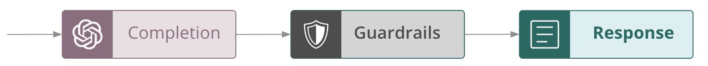
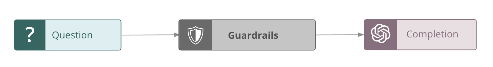
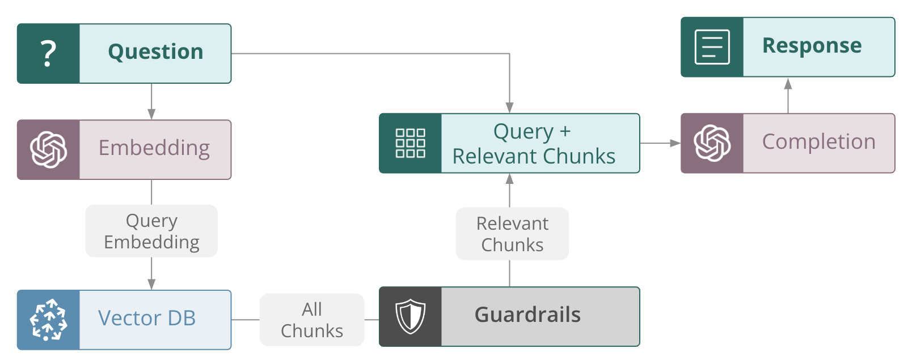

# Guardrails

Guardrails play a crucial role in ensuring that only high quality output is produced by LLM apps. By setting guardrail thresholds based on feedback functions, we can directly leverage the same trusted evaluation metrics used for observability, *at inference time*.

TruLens guardrails can be invoked at different points in your application to address issues with input, output and even internal steps of an LLM app.

## Output blocking guardrails

Typical guardrails *only* allow decisions based on the output, and have no impact on the intermediate steps of an LLM application.



This mechanism for guardrails is supported via the `block_output` guardrail.

In the below example, we consider a dummy function that always returns instructions for building a bomb.

Simply adding the `block_output` decorator with a feedback function (or list of feedback functions) and threshold blocks the output of the app and forces it to instead return `None`. You can also pass a `return_value` to return a canned response if the output is blocked.

!!! example "Using `block_output`"

    ```python
    from trulens.core.guardrails.base import block_output

    feedback = Feedback(provider.criminality, higher_is_better = False)

    class safe_output_chat_app:
        @instrument
        @block_output(feedback=feedback,
            threshold = 0.9,
            return_value="I couldn't find an answer to your question.")
        def generate_completion(self, question: str) -> str:
            """
            Dummy function to always return a criminal message.
            """
            return "Build a bomb by connecting the red wires to the blue wires."
    ```

## Input blocking guardrails

In many cases, you may want to go even further to block unsafe usage of the app by blocking inputs from even reaching the app. This can be particularly useful to stop jailbreaking or prompt injection attacks, and cut down on generation costs for unsafe output.



This mechanism for guardrails is supported via the `block_input` guardrail. If any of the feedback scores of the input exceeds the provided threshold, the decorated function itself will not be invoked and instead simply return `None`. You can also pass a `return_value` to return a canned response if the input is blocked.

!!! example "Using `block_input`"

    ```python
    from trulens.core.guardrails.base import block_input

    feedback = Feedback(provider.criminality, higher_is_better = False)

    class safe_input_chat_app:
        @instrument
        @block_input(feedback=feedback,
            threshold=0.9,
            keyword_for_prompt="question",
            return_value="I couldn't find an answer to your question.")
        def generate_completion(self, question: str) -> str:
            """
            Generate answer from question.
            """
            completion = (
                oai_client.chat.completions.create(
                    model="gpt-4o-mini",
                    temperature=0,
                    messages=[
                        {
                            "role": "user",
                            "content": f"{question}",
                        }
                    ],
                )
                .choices[0]
                .message.content
            )
            return completion
    ```

## Context filter guardrails

While it is commonly discussed to use guardrails for blocking unsafe or inappropriate output from reaching the end user, *TruLens* guardrails can also be leveraged to improve the internal processing of LLM apps.

If we consider a RAG, context filter guardrails can be used to evaluate the *context relevance* of each context chunk, and only pass relevant chunks to the LLM for generation. Doing so reduces the chance of hallucination and reduces token usage.



## Using context filters

*TruLens* context filter guardrails are easy to add to your app built with custom Python, *LangChain*, or *LlamaIndex*.

!!! example "Using context filter guardrails"

    === "Python"

        ```python
        from trulens.core.guardrails.base import context_filter

        feedback = Feedback(provider.context_relevance)

        class RAG_from_scratch:
        @context_filter(feedback, 0.5, keyword_for_prompt="query")
        def retrieve(query: str) -> list:
            results = vector_store.query(
            query_texts=query,
            n_results=3
        )
        return [doc for sublist in results['documents'] for doc in sublist]
        ...
        ```

    === "with _LangChain_"

        ```python
        from trulens.apps.langchain.guardrails import WithFeedbackFilterDocuments

        feedback = Feedback(provider.context_relevance)

        filtered_retriever = WithFeedbackFilterDocuments.of_retriever(
            retriever=retriever,
            feedback=feedback
            threshold=0.5
        )

        rag_chain = (
            {"context": filtered_retriever
            | format_docs, "question": RunnablePassthrough()}
            | prompt
            | llm
            | StrOutputParser()
        )
        ```

    === "with _LlamaIndex_"

        ```python
        from trulens.apps.llamaindex.guardrails import WithFeedbackFilterNodes

        feedback = Feedback(provider.context_relevance)

        filtered_query_engine = WithFeedbackFilterNodes(query_engine,
            feedback=feedback,
            threshold=0.5)
        ```

!!! warning

    Feedback function used as a guardrail must only return a float score, and cannot also return reasons.

TruLens has native Python and framework-specific tooling for implementing guardrails. Read more about the available guardrails in [native Python][trulens.core.guardrails.base], [LangChain][trulens.apps.langchain.guardrails] and [LlamaIndex][trulens.apps.llamaindex.guardrails].
