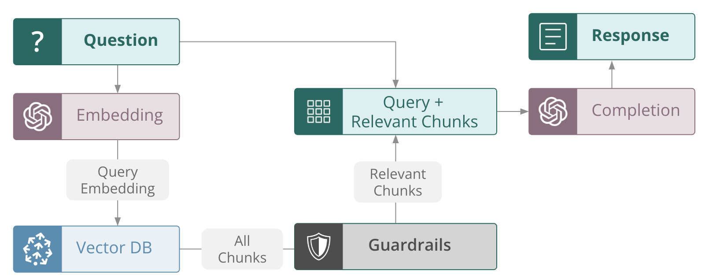

# Guardrails

Guardrails play a crucial role in ensuring that only high quality output is produced by LLM apps. By setting guardrail thresholds based on feedback functions, we can directly leverage the same trusted evaluation metrics used for observability, *at inference time*.

## Typical guardrail usage

Typical guardrails *only* allow decisions based on the output, and have no impact on the intermediate steps of an LLM application.


## _TruLens_ guardrails for internal steps

While it is commonly discussed to use guardrails for blocking unsafe or inappropriate output from reaching the end user, _TruLens_ guardrails can also be leveraged to improve the internal processing of LLM apps.

If we consider a RAG, context filter guardrails can be used to evaluate the *context relevance* of each context chunk, and only pass relevant chunks to the LLM for generation. Doing so reduces the chance of hallucination and reduces token usage.



## Using _TruLens_ guardrails

_TruLens_ context filter guardrails are easy to add to your app built with custom python, _Langchain_, or _Llama-Index_.

!!! example "Using context filter guardrails"

    === "python"

        ```python
        from trulens.guardrails.base import context_filter

        feedback = Feedback(provider.context_relevance)

        class RAG_from_scratch:
        @context_filter(feedback, 0.5, keyword_for_prompt="query")
        def retrieve(query: str) -> list:
            results = vector_store.query(
            query_texts=query,
            n_results=3
        )
        return [doc for sublist in results['documents'] for doc in sublist]
        ...
        ```

    === "with _Langchain_"

        ```python
        from trulens.langchain.guardrails import WithFeedbackFilterDocuments

        feedback = Feedback(provider.context_relevance)

        filtered_retriever = WithFeedbackFilterDocuments.of_retriever(
            retriever=retriever,
            feedback=feedback
            threshold=0.5
        )

        rag_chain = (
            {"context": filtered_retriever
            | format_docs, "question": RunnablePassthrough()}
            | prompt
            | llm
            | StrOutputParser()
        )
        ```

    === "with _Llama-Index_"

        ```python
        from trulens.guardrails.llama import WithFeedbackFilterNodes

        feedback = Feedback(provider.context_relevance)

        filtered_query_engine = WithFeedbackFilterNodes(query_engine,
            feedback=feedback,
            threshold=0.5)
        ```

!!! warning

    Feedback function used as a guardrail must only return a float score, and cannot also return reasons.

TruLens has native python and framework-specific tooling for implementing guardrails. Read more about the availble guardrails in [native python](../api/guardrails/index), [Langchain](../api/guardrails/langchain) and [Llama-Index](../api/guardrails/llama).
