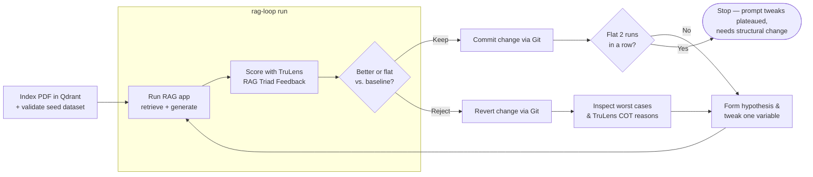
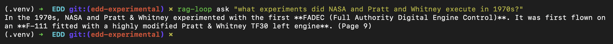
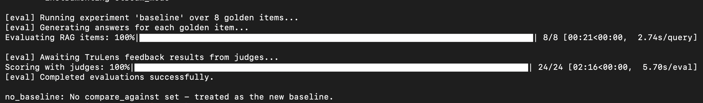
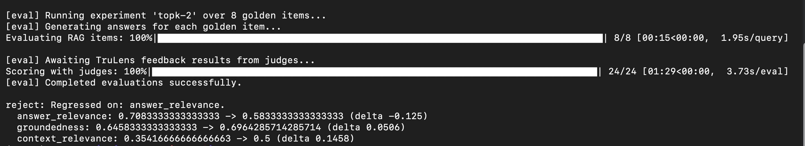
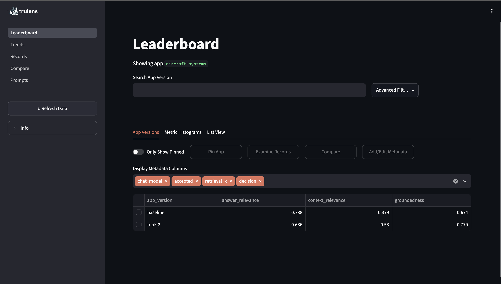
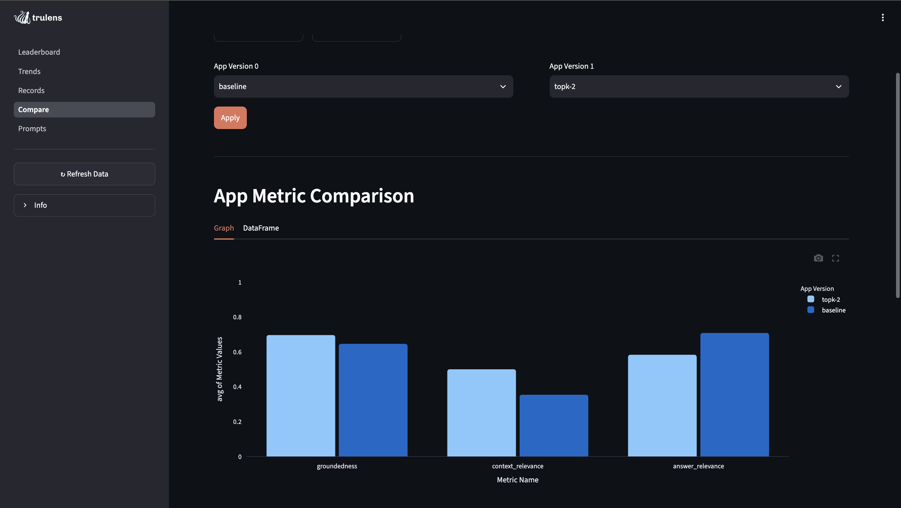

# Automating Eval-Driven Development (EDD) with TruLens

This project demonstrates **Eval-Driven Development (EDD)** for LLM applications using **TruLens**.

It implements a complete RAG system that answers technical questions about aircraft systems from an FAA flight manual PDF, using evaluations to systematically guide improvements.



## Architecture & Stack

- **RAG Orchestration**: [LangGraph](https://github.com/langchain-ai/langgraph) (retrieve → generate state graph).
- **Generation**: OpenAI (`gpt-5.6-luna`).
- **Embeddings**: OpenAI (`text-embedding-3-small`, requires `OPENAI_API_KEY`).
- **Vector Database**: [Qdrant Cloud](https://cloud.qdrant.io/) or local Qdrant.
- **Evaluation & Tracing**: **TruLens** (`trulens-core`, `trulens-feedback`, `trulens-apps-langgraph`, `trulens-providers-openai`).

## The TruLens RAG Triad

TruLens evaluates RAG systems across three orthogonal dimensions:

1. **Context Relevance**: Does the retrieved context contain information relevant to answering the query?
2. **Groundedness**: Is the generated response strictly grounded in the retrieved context, or does it hallucinate?
3. **Answer Relevance**: Does the final answer directly and completely address the original user query?

In addition, an experiment-level metric **Clean Negative Recall** checks that known unanswerable questions (`label = 0` in `evals/seed.jsonl`) trigger honest refusals rather than fabricated answers.

---

## Initial Setup

Run once before starting the development loop:

1. **Clone and install**:

```sh
git clone https://github.com/truera/trulens.git
cd trulens/examples/experimental/EDD
```

Now create and activate a virtual environment, then install**:

```sh
python3 -m venv .venv
source .venv/bin/activate
pip install -e .
```

2. **Configure environment variables**:

```sh
cp .env.example .env
```

Fill in `OPENAI_API_KEY`, `QDRANT_URL`, and `QDRANT_API_KEY` in `.env`.

3. **Build the search index in Qdrant**:

```sh
rag-loop index
```

> [!NOTE]
> Re-run `rag-loop index` whenever `chunk_size`, `chunk_overlap`, or the source PDF changes.

4. **Sanity check with a single query**:

```sh
rag-loop ask "what experiments did NASA and Pratt and Whitney execute in 1970s?"
```



---

## The Iterative EDD Loop

Run repeatedly, testing one variable at a time:

### 1. Validate the Golden Dataset

Verify `evals/seed.jsonl` contains valid test items with questions, page citations, and expected answers:

```sh
rag-loop seed
```

### 2. Define an Experiment

Add a new candidate entry to `evals/experiments.json` isolating **one single variable** (`retrieval_k`, model, or prompt wording in `src/rag_loop/rag.py`):

> In our case I have already included few experiments

```json
{
  "name": "topk-2",
  "change": "retrieval_k 4 -> 2",
  "chat_model": "gpt-4.1-nano",
  "retrieval_k": 2,
  "acceptance": {
    "compare_against": "baseline",
    "required_metrics": [
      "answer_relevance",
      "groundedness",
      "context_relevance"
    ]
  }
}
```

### 3. Run and Decide

Run the experiment by name. `rag-loop run` executes the pipeline with TruLens tracing and feedback functions, saves the results to `evals/results/<name>.json`, compares metrics against `compare_against`, and manages Git automatically:
- **Keep**: If all required metrics improved or remained flat, the change is committed.
- **Reject**: If any required metric regressed, `src/` is automatically reverted to the previous clean state.

```sh
# Run baseline first (always kept as the benchmark)
rag-loop run baseline
```



```sh
# Run the candidate experiment
rag-loop run topk-2
```



> On the first `rag-loop run` there is no comparison since it is the baseline, but notice that the `topk-2` run shows the comparison against the baseline.

### 4. Analyze Failures

If an experiment is rejected or produces unexpected results, inspect the lowest-scoring test cases along with the Chain-of-Thought (COT) explanations from the TruLens judges:

```sh
rag-loop report topk-2
```

### 5. Check for Plateaus

If two consecutive kept iterations produce no metric movement, the loop warns that the app has **plateaued**. This indicates that small prompt tweaks are no longer providing gains and that structural improvements are needed (e.g. reranking, document chunking strategy, or hybrid sparse/dense search).

---

## Inspecting Results & TruLens Dashboard

### Interactive Dashboard

Launch the TruLens dashboard to visually explore records, execution traces, span timelines, and feedback evaluations:

```sh
rag-loop dashboard
```





Open [http://localhost:8501](http://localhost:8501) in your browser.

### History & Auditing

- **Git commits**: Every run produces a clean git log:
  - Kept runs: `<name>: <change>`
  - Rejected runs: `<name> (rejected): <change>` (with code changes reverted)
- **Scoreboard**: `evals/experiments.json` retains the complete decision history and metric comparisons.
- **Result snapshots**: `evals/results/<name>.json` stores full evaluations, per-case scores, and judge rationales.
