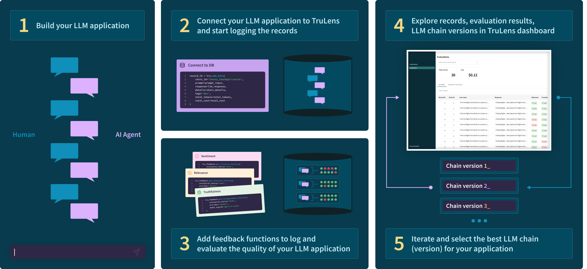
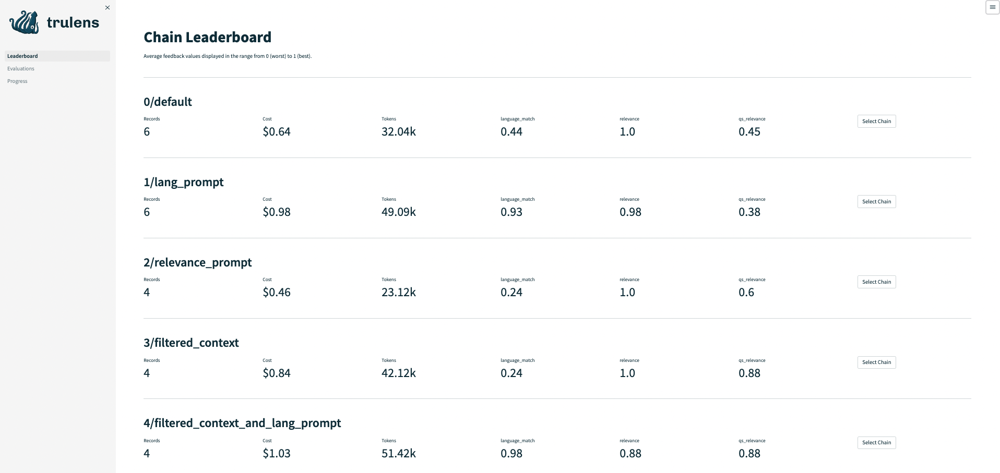
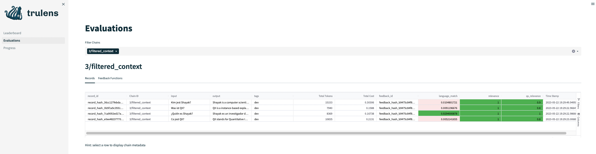
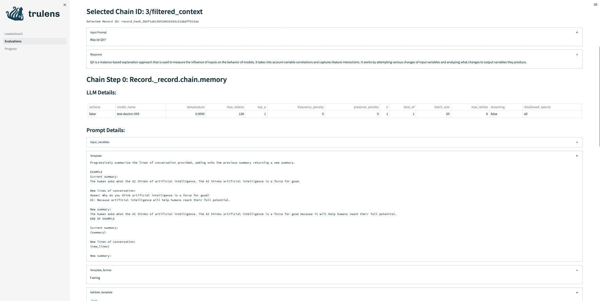

# Welcome to TruLens-Eval!


Evaluate and track your LLM experiments with TruLens. As you work on your models and prompts TruLens-Eval supports the iterative development and of a wide range of LLM applications by wrapping your application to log key metadata across the entire chain (or off chain if your project does not use chains) on your local machine.

Using feedback functions, you can objectively evaluate the quality of the responses provided by an LLM to your requests. This is completed with minimal latency, as this is achieved in a sequential call for your application, and evaluations are logged to your local machine. Finally, we provide an easy to use streamlit dashboard run locally on your machine for you to better understand your LLM’s performance.



# Quick Usage
To quickly play around with the TruLens Eval library, download this notebook: [trulens_eval_quickstart.ipynb](https://github.com/truera/trulens_private/blob/main/trulens_eval/trulens_eval_quickstart.ipynb).


# Installation and Setup

Install trulens-eval from pypi.

```
pip install trulens-eval
```

Imports from langchain to build app, trulens for evaluation

```python
from IPython.display import JSON
# imports from langchain to build app
from langchain import PromptTemplate
from langchain.chains import LLMChain
from langchain.chat_models import ChatOpenAI
from langchain.prompts.chat import ChatPromptTemplate
from langchain.prompts.chat import HumanMessagePromptTemplate
# imports from trulens to log and get feedback on chain
from trulens_eval.tru import Tru
from trulens_eval import tru_chain
tru = Tru()
```

## API Keys

Our example chat app and feedback functions call external APIs such as OpenAI or Huggingface. You can add keys by setting the environment variables. 

### In Python

```python
import os
os.environ["OPENAI_API_KEY"] = "..."
```
### In Terminal

```bash
export OPENAI_API_KEY = "..."
```

## Create a basic LLM chain to evaluate

This example uses langchain and OpenAI, but the same process can be followed with any framework and model provider. Once you've created your chain, just call TruChain to wrap it. Doing so allows you to capture the chain metadata for logging.

```python
full_prompt = HumanMessagePromptTemplate(
    prompt=PromptTemplate(
        template="Provide a helpful response with relevant background information for the following: {prompt}",
            input_variables=["prompt"],
        )
    )
chat_prompt_template = ChatPromptTemplate.from_messages([full_prompt])

chat = ChatOpenAI(model_name='gpt-3.5-turbo', temperature=0.9)

chain = LLMChain(llm=chat, prompt=chat_prompt_template)

# wrap with truchain to instrument your chain
tc = tru_chain.TruChain(chain)
```

## Set up logging and instrumentation

Make the first call to your LLM Application. The instrumented chain can operate like the original but can also produce a log or "record" of the chain execution.

```python
prompt_input = 'que hora es?'
gpt3_response, record = tc.call_with_record(prompt_input)
```

We can log the records but first we need to log the chain itself.

```python
tru.add_chain(chain_json=tc.json)
```

Now we can log the record:
```python
tru.add_record(
    prompt=prompt_input, # prompt input
    response=gpt3_response['text'], # LLM response
    record_json=record # record is returned by the TruChain wrapper
)
```

# Evaluate Quality

Following the request to your app, you can then evaluate LLM quality using feedback functions. This is completed in a sequential call to minimize latency for your application, and evaluations will also be logged to your local machine.

To get feedback on the quality of your LLM, you can use any of the provided feedback functions or add your own.

To assess your LLM quality, you can provide the feedback functions to tru.run_feedback() in a list as shown below. Here we'll just add a simple language match checker.
```python
from trulens_eval.tru_feedback import Feedback, Huggingface

os.environ["HUGGINGFACE_API_KEY"] = "..."

# Initialize Huggingface-based feedback function collection class:
hugs = Huggingface()

# Define a language match feedback function using HuggingFace.
f_lang_match = Feedback(hugs.language_match).on(
    text1="prompt", text2="response"
)

# Run feedack functions. This might take a moment if the public api needs to load the language model used by the feedback function.
feedback_result = f_lang_match.run_on_record(
    chain_json=tc.json, record_json=record
)

JSON(feedback_result)

# We can also run a collection of feedback functions
feedback_results = tru.run_feedback_functions(
    record_json=record,
    feedback_functions=[f_lang_match]
)
display(feedback_results)
```

After capturing feedback, you can then log it to your local database
```python
tru.add_feedback(feedback_results)
```

## Automatic logging
The above logging and feedback function evaluation steps can be done by TruChain.
```python
tc = tru_chain.TruChain(
    chain,
    chain_id='Chain1_ChatApplication',
    feedbacks=[f_lang_match],
    tru=tru
)
# Note: providing `db: TruDB` causes the above constructor to log the wrapped chain in the database specified.
# Note: any `feedbacks` specified here will be evaluated and logged whenever the chain is used.

tc("This will be automatically logged.")
```

## Out-of-band Feedback evaluation

In the above example, the feedback function evaluation is done in the same process as the chain evaluation. The alternative approach is the use the provided persistent evaluator started via `tru.start_deferred_feedback_evaluator`. Then specify the `feedback_mode` for `TruChain` as `deferred` to let the evaluator handle the feedback functions.

For demonstration purposes, we start the evaluator here but it can be started in another process.
```python
tc: tru_chain.TruChain = tru_chain.TruChain(
    chain,
    chain_id='Chain1_ChatApplication',
    feedbacks=[f_lang_match],
    tru=tru,
    feedback_mode="deferred"
)

tru.start_evaluator()
tc("This will be logged by deferred evaluator.")
tru.stop_evaluator()
```


## Run the dashboard!
```python
tru.run_dashboard() # open a streamlit app to explore
# tru.stop_dashboard() # stop if needed
```

## Chain Leaderboard: Quickly identify quality issues.

Understand how your LLM application is performing at a glance. Once you've set up logging and evaluation in your application, you can view key performance statistics including cost and average feedback value across all of your LLM apps using the chain leaderboard. As you iterate new versions of your LLM application, you can compare their performance across all of the different quality metrics you've set up.

Note: Average feedback values are returned and displayed in a range from 0 (worst) to 1 (best).



To dive deeper on a particular chain, click "Select Chain".

## Understand chain performance with Evaluations
 
To learn more about the performance of a particular chain or LLM model, we can select it to view its evaluations at the record level. LLM quality is assessed through the use of feedback functions. Feedback functions are extensible methods for determining the quality of LLM responses and can be applied to any downstream LLM task. Out of the box we provide a number of feedback functions for assessing model agreement, sentiment, relevance and more.

The evaluations tab provides record-level metadata and feedback on the quality of your LLM application.




Click on a record to dive deep into all of the details of your chain stack and underlying LLM, captured by tru_chain.



If you prefer the raw format, you can quickly get it using the "Display full chain json" or "Display full record json" buttons at the bottom of the page.

## Out-of-the-box Feedback Functions
See: <https://www.trulens.org/trulens_eval/api/tru_feedback/>

### Relevance

This evaluates the *relevance* of the LLM response to the given text by LLM prompting.

Relevance is currently only available with OpenAI ChatCompletion API.

### Sentiment

This evaluates the *positive sentiment* of either the prompt or response.

Sentiment is currently available to use with OpenAI, HuggingFace or Cohere as the model provider.

* The OpenAI sentiment feedback function prompts a Chat Completion model to rate the sentiment from 1 to 10, and then scales the response down to 0-1.
* The HuggingFace sentiment feedback function returns a raw score from 0 to 1.
* The Cohere sentiment feedback function uses the classification endpoint and a small set of examples stored in feedback_prompts.py to return either a 0 or a 1.

### Model Agreement

Model agreement uses OpenAI to attempt an honest answer at your prompt with system prompts for correctness, and then evaluates the aggreement of your LLM response to this model on a scale from 1 to 10. The agreement with each honest bot is then averaged and scaled from 0 to 1.

### Language Match

This evaluates if the language of the prompt and response match.

Language match is currently only available to use with HuggingFace as the model provider. This feedback function returns a score in the range from 0 to 1, where 1 indicates match and 0 indicates mismatch.

### Toxicity

This evaluates the toxicity of the prompt or response.

Toxicity is currently only available to be used with HuggingFace, and uses a classification endpoint to return a score from 0 to 1. The feedback function is negated as not_toxicity, and returns a 1 if not toxic and a 0 if toxic.

### Moderation

The OpenAI Moderation API is made available for use as feedback functions. This includes hate, hate/threatening, self-harm, sexual, sexual/minors, violence, and violence/graphic. Each is negated (ex: not_hate) so that a 0 would indicate that the moderation rule is violated. These feedback functions return a score in the range 0 to 1.

# Adding new feedback functions

Feedback functions are an extensible framework for evaluating LLMs. You can add your own feedback functions to evaluate the qualities required by your application by updating trulens_eval/tru_feedback.py. If your contributions would be useful for others, we encourage you to contribute to trulens!

Feedback functions are organized by model provider into Provider classes.

The process for adding new feedback functions is:
1. Create a new Provider class or locate an existing one that applies to your feedback function. If your feedback function does not rely on a model provider, you can create a standalone class:

```python
class StandAlone(Provider):
    def __init__(self):
    pass
```

2. Add a new feedback function method to your selected class. Your new method can either take a single text (str) as a parameter or both promopt (str) and response (str). It should return a float between 0 (worst) and 1 (best).

```python
def feedback(self, text: str) -> float:
        """
        Describe how the model works

        Parameters:
            text (str): Text to evaluate.
            Can also be prompt (str) and response (str).

        Returns:
            float: A value between 0 (worst) and 1 (best).
        """
        return float
```
